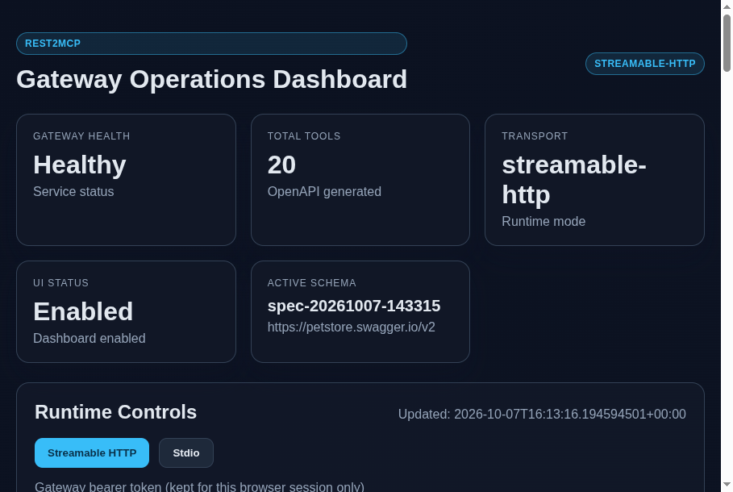
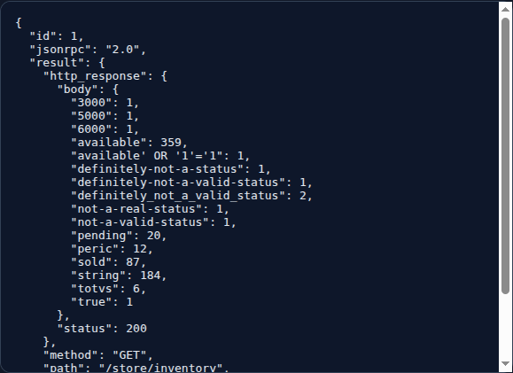
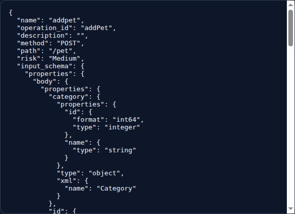
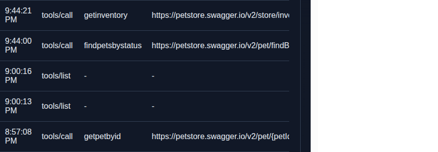

# REST2MCP

REST2MCP is a Rust prototype gateway that reads an OpenAPI 3.x or Swagger 2.0 document, exposes supported operations as MCP-style tools, and forwards tool calls to a REST backend. It includes a browser dashboard, SQLite persistence for loaded schemas and request logs, basic bearer-token protection, and destructive-operation approval.

> **Prototype notice:** This project demonstrates the gateway flow; it is not a production-ready OAuth/SSO gateway. See [Security and limitations](docs/security.md#current-limitations) before exposing it beyond localhost.

## Prerequisites

- Rust toolchain (stable; edition 2024)
- Network access to fetch Cargo dependencies on the first build
- A REST backend described by the OpenAPI/Swagger document you load

## Quick start

From the repository root:

```sh
cargo run
```

The HTTP gateway binds to `127.0.0.1:3000` by default. Visit [http://127.0.0.1:3000/](http://127.0.0.1:3000/) to open the dashboard, or check readiness:

```sh
curl http://127.0.0.1:3000/health
```

Expected health response: `ok`.

## Typical dashboard flow

1. Open the dashboard at `http://127.0.0.1:3000/`.
2. Load an OpenAPI/Swagger JSON or YAML file, or paste its contents in **OpenAPI Spec Loader**. Optionally give it a name and select **Validate & Load**.
3. Check **Active schema** and the generated tools table. The gateway saves loaded specs to SQLite and restores the last active spec on restart.
4. Select a tool in **Manual MCP Tester**. Generate a sample request, edit its JSON arguments if necessary, and select **Send request**.
5. Read the response and **Recent Request Logs**. Request logs omit input payloads and response bodies.
6. For a destructive operation, review the pending action and choose **Approve pending action** only if it is intended. The token is short-lived, bound to the caller identity, single-use, and is not retained across restart.
7. Manage saved specs with **Load**/**Delete** and request history with **Clear logs**. The active spec cannot be deleted; load a different spec first.

## Screenshots

The following captures were taken from a locally running dashboard with the Petstore Swagger 2.0 contract loaded. The tool response is a live read-only `getinventory` example.

### Dashboard



### Tool response and schema

| MCP tool response | Generated tool schema |
| --- | --- |
|  |  |

### Request history



A real tool call reaches the API server from the loaded spec. Make sure that backend is reachable by the gateway process. The local built-in sample points to `http://127.0.0.1:8080` unless its spec defines a server URL.

## Backend URL selection

- OpenAPI 3 uses the first entry in `servers[].url`, including its base path. Server URL variables are replaced with their declared `default` values.
- Swagger 2 uses `schemes`, `host`, and `basePath`. When `schemes` is missing, HTTPS is assumed.
- If neither format supplies a backend URL, the gateway uses `REST2MCP_API_BASE_URL` (default `http://127.0.0.1:8080`).

For example, Swagger `host: petstore.swagger.io`, `basePath: /v2`, and `schemes: [https]` route `/pet/findByStatus` to `https://petstore.swagger.io/v2/pet/findByStatus`.

## Configuration

Configuration is read from environment variables before startup:

| Variable | Purpose | Default |
| --- | --- | --- |
| `REST2MCP_BIND` | HTTP listen socket | `127.0.0.1:3000` |
| `REST2MCP_TRANSPORT` | `streamable-http` or `stdio` | `streamable-http` |
| `REST2MCP_ENABLE_UI` | Enable dashboard and UI endpoints | `true` |
| `REST2MCP_API_BASE_URL` | Fallback backend URL for specs without a server URL | `http://127.0.0.1:8080` |
| `REST2MCP_DB_PATH` | SQLite file path | `rest2mcp.sqlite3` in the working directory |
| `REST2MCP_AUTH_TOKEN` | Static gateway bearer token; required for non-loopback binds | unset |
| `REST2MCP_AUTH_SCOPES` | Comma-separated scopes assigned to the configured token | `read:resources` |
| `REST2MCP_REQUESTS_PER_MINUTE` | Process-wide MCP request limit | `120` |
| `REST2MCP_BACKEND_BEARER_TOKEN` | Credential injected into backend HTTP requests | unset |
| `REST2MCP_LOG_TO_STDERR` | Route tracing logs to stderr | `true` |

Example local run with a custom database and fallback backend:

```sh
REST2MCP_DB_PATH="$HOME/.local/share/rest2mcp/gateway.sqlite3" \
REST2MCP_API_BASE_URL="http://127.0.0.1:8080" \
cargo run
```

For remote binding, use a strong token, select only the scopes required, and terminate TLS at a trusted reverse proxy. To enable dashboard mutations when token auth is configured, the token's scope list must include `admin:write`; tool calls also require their corresponding read/write scope. The dashboard's **Use token** field keeps the token in browser `sessionStorage` for the current session only.

## Calling MCP-style JSON-RPC directly

List tools:

```sh
curl -sS http://127.0.0.1:3000/mcp \
  -H 'Content-Type: application/json' \
  -d '{"jsonrpc":"2.0","id":1,"method":"tools/list","params":{}}'
```

Call a tool using the generated tool name and flattened argument fields (this matches the current gateway implementation):

```sh
curl -sS http://127.0.0.1:3000/mcp \
  -H 'Content-Type: application/json' \
  -d '{"jsonrpc":"2.0","id":2,"method":"tools/call","params":{"name":"findpetsbystatus","status":"available"}}'
```

When `REST2MCP_AUTH_TOKEN` is configured, include `-H 'Authorization: Bearer <token>'`. JSON-RPC errors are returned in an `error` object; a `tools/call` can also return `approval_required` with an `approval_token`. After human review, approve it with:

```sh
curl -sS http://127.0.0.1:3000/mcp \
  -H 'Content-Type: application/json' \
  -H 'Authorization: Bearer <token>' \
  -d '{"jsonrpc":"2.0","id":3,"method":"tools/approve","params":{"approval_token":"<approval-token>"}}'
```

If no gateway token is configured, omit the authorization header. The HTTP demo caller then has read-only scope; privileged operations are not available.

## Stdio mode

Run the process in stdio mode for a client that launches a local MCP subprocess:

```sh
REST2MCP_TRANSPORT=stdio cargo run
```

Stdio mode reads one JSON-RPC request per input line and writes one JSON response per line to stdout; diagnostic logs go to stderr. Configure the application-specific command and environment variables in your MCP client. The current stdio caller is intentionally limited to read/write scopes and does not provide external identity verification.

## Stored data

The SQLite database retains up to 10 saved specs and 1,000 operational request-log entries. It also stores the selected active spec. The default database and SQLite journal files are ignored by Git; set `REST2MCP_DB_PATH` to control its location. Deleting the database removes the saved specs, active selection, and request history.

## Development

```sh
cargo test
cargo check
```

## Documentation

- [Detailed setup and flow](docs/README.md)
- [Architecture](docs/architecture.md)
- [Security and limitations](docs/security.md)
- [Project requirements](docs/openapi_to_mcp_gateway_requirements.md)
